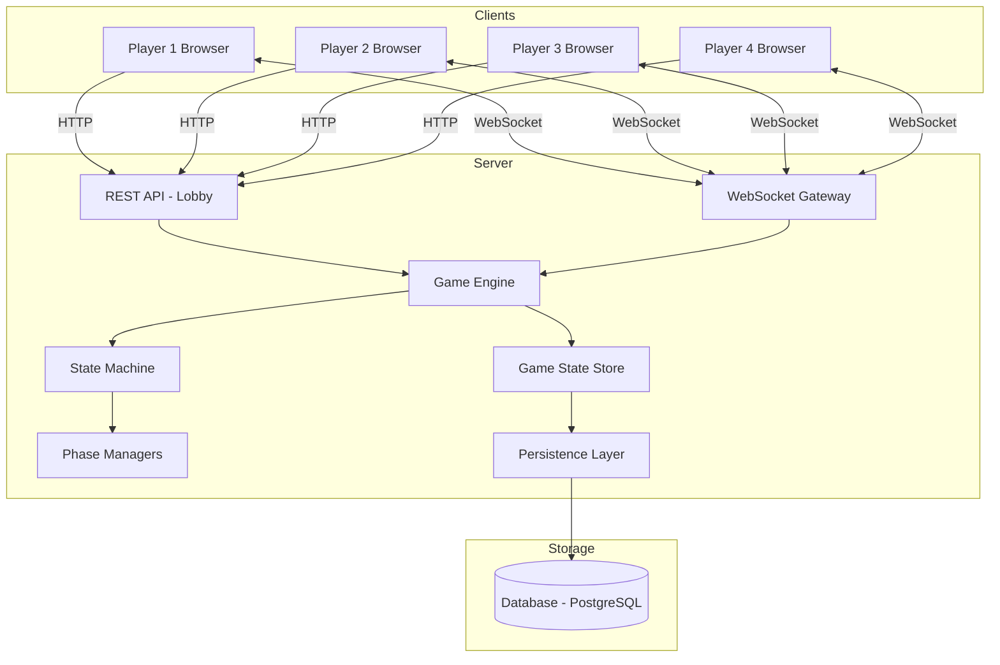
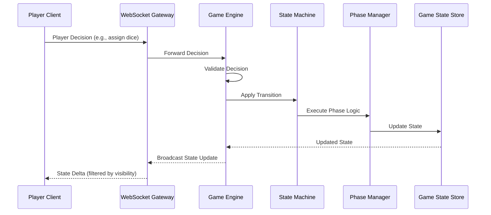
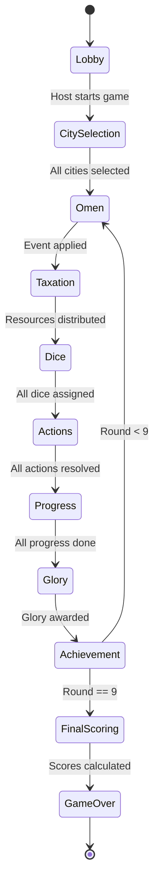

# Design Document: Khora Online

## Overview

Khora Online is a real-time multiplayer web application that faithfully implements the board game "Khora: Rise of an Empire" for 2–4 players. The system manages lobby creation, city selection, 9 rounds of 7-phase gameplay, resource management, action resolution, scoring, and real-time synchronization over WebSockets.

The architecture follows a client-server model with an authoritative server. All game logic, randomness, and state transitions live on the server to prevent cheating and ensure consistency. Clients are thin views that send player decisions and render the current game state.

### Key Design Decisions

- **Authoritative Server**: The server owns all game state and validates every player action. Clients never mutate state directly.
- **TypeScript Full-Stack**: TypeScript for both server (Node.js) and client (React), enabling shared type definitions for game state, actions, and messages.
- **WebSocket Communication**: Persistent WebSocket connections for real-time bidirectional updates. HTTP REST used only for lobby creation/joining.
- **State Machine Architecture**: Game progression modeled as a finite state machine with well-defined phase transitions, making it easy to validate legal transitions and serialize/restore state.
- **Event Sourcing for Game Log**: All state mutations are recorded as events, providing a complete game log and enabling replay/debugging.

## Architecture



### Component Interaction Flow



### State Machine — Round Phases




## Components and Interfaces

### 1. REST API (Lobby Management)

Handles lobby lifecycle before a game begins.

```typescript
// POST /api/lobbies — Create a new lobby
interface CreateLobbyRequest {
  hostPlayerName: string;
}
interface CreateLobbyResponse {
  lobbyId: string;
  inviteCode: string; // 6-character alphanumeric
}

// POST /api/lobbies/join — Join an existing lobby
interface JoinLobbyRequest {
  inviteCode: string;
  playerName: string;
}
interface JoinLobbyResponse {
  lobbyId: string;
  playerId: string;
  players: PlayerInfo[];
}

// POST /api/lobbies/:lobbyId/start — Host starts the game
// Returns 400 if fewer than 2 players
interface StartGameResponse {
  gameId: string;
  wsUrl: string; // WebSocket URL for the game session
}
```

### 2. WebSocket Gateway

Manages persistent connections and message routing. All in-game communication flows through WebSocket.

```typescript
// Client → Server messages
type ClientMessage =
  | { type: 'SELECT_CITY'; cityId: string }
  | { type: 'ASSIGN_DICE'; assignments: DiceAssignment[] }
  | { type: 'RESOLVE_ACTION'; actionType: ActionType; choices: ActionChoices }
  | { type: 'PROGRESS_TRACKS'; advancements: TrackAdvancement[] }
  | { type: 'SKIP_PHASE' }
  | { type: 'CLAIM_ACHIEVEMENT'; achievementId: string }
  | { type: 'HEARTBEAT' };

// Server → Client messages
type ServerMessage =
  | { type: 'GAME_STATE_UPDATE'; state: PublicGameState; privateState: PrivatePlayerState }
  | { type: 'PHASE_CHANGE'; phase: PhaseType; roundNumber: number }
  | { type: 'AWAITING_DECISION'; playerId: string; decisionType: DecisionType; timeoutMs: number }
  | { type: 'GAME_LOG_ENTRY'; entry: GameLogEntry }
  | { type: 'PLAYER_DISCONNECTED'; playerId: string }
  | { type: 'PLAYER_RECONNECTED'; playerId: string }
  | { type: 'GAME_OVER'; finalScores: FinalScoreBoard }
  | { type: 'ERROR'; code: string; message: string };
```

### 3. Game Engine

The central orchestrator. Receives validated player decisions, applies them to the state machine, and triggers broadcasts.

```typescript
interface GameEngine {
  // Lifecycle
  initializeGame(players: PlayerInfo[], citySelections: Map<string, string>): GameState;
  
  // Decision handling
  handlePlayerDecision(gameId: string, playerId: string, decision: ClientMessage): Result<GameState, GameError>;
  
  // Timer management
  handleTimeout(gameId: string, playerId: string): GameState;
  
  // Reconnection
  getFullStateForPlayer(gameId: string, playerId: string): { public: PublicGameState; private: PrivatePlayerState };
}
```

### 4. State Machine

Enforces legal phase transitions and tracks the current game position.

```typescript
interface StateMachine {
  currentPhase: GamePhase;
  roundNumber: number; // 1–9
  
  canTransition(from: GamePhase, to: GamePhase): boolean;
  transition(to: GamePhase): void;
  isGameOver(): boolean;
}

type GamePhase =
  | 'LOBBY'
  | 'CITY_SELECTION'
  | 'OMEN'
  | 'TAXATION'
  | 'DICE'
  | 'ACTIONS'
  | 'PROGRESS'
  | 'GLORY'
  | 'ACHIEVEMENT'
  | 'FINAL_SCORING'
  | 'GAME_OVER';
```

### 5. Phase Managers

Each phase has a dedicated manager that encapsulates its logic. All phase managers implement a common interface.

```typescript
interface PhaseManager {
  // Called when the phase begins
  onEnter(state: GameState): GameState;
  
  // Process a player's decision within this phase
  handleDecision(state: GameState, playerId: string, decision: ClientMessage): Result<GameState, GameError>;
  
  // Check if all players have completed this phase
  isComplete(state: GameState): boolean;
  
  // Auto-resolve for timeouts or disconnected players
  autoResolve(state: GameState, playerId: string): GameState;
}

// Concrete implementations
class OmenPhaseManager implements PhaseManager { /* ... */ }
class TaxationPhaseManager implements PhaseManager { /* ... */ }
class DicePhaseManager implements PhaseManager { /* ... */ }
class ActionPhaseManager implements PhaseManager { /* ... */ }
class ProgressPhaseManager implements PhaseManager { /* ... */ }
class GloryPhaseManager implements PhaseManager { /* ... */ }
class AchievementPhaseManager implements PhaseManager { /* ... */ }
```

### 6. Action Resolvers

Each of the 7 action types has a dedicated resolver.

```typescript
interface ActionResolver {
  readonly actionNumber: number; // 1–7
  readonly actionType: ActionType;
  
  canPerform(state: GameState, playerId: string, dieValue: number): ActionCostResult;
  resolve(state: GameState, playerId: string, choices: ActionChoices): Result<GameState, GameError>;
}

type ActionType = 'PHILOSOPHY' | 'LEGISLATION' | 'CULTURE' | 'TRADE' | 'MILITARY' | 'POLITICS' | 'DEVELOPMENT';

// 7 concrete resolvers
class PhilosophyResolver implements ActionResolver { /* actionNumber: 1 */ }
class LegislationResolver implements ActionResolver { /* actionNumber: 2 */ }
class CultureResolver implements ActionResolver { /* actionNumber: 3 */ }
class TradeResolver implements ActionResolver { /* actionNumber: 4 */ }
class MilitaryResolver implements ActionResolver { /* actionNumber: 5 */ }
class PoliticsResolver implements ActionResolver { /* actionNumber: 6 */ }
class DevelopmentResolver implements ActionResolver { /* actionNumber: 7 */ }
```

### 7. Scoring Engine

Handles all Victory Point calculations including final scoring.

```typescript
interface ScoringEngine {
  calculateGloryPoints(state: GameState, eventCard: EventCard): Map<string, number>;
  calculateFinalScores(state: GameState): FinalScoreBoard;
  applyTiebreakers(scores: PlayerScore[]): PlayerScore[];
}

interface FinalScoreBoard {
  rankings: PlayerFinalScore[];
  winnerId: string;
}

interface PlayerFinalScore {
  playerId: string;
  playerName: string;
  breakdown: {
    gloryPoints: number;
    achievementPoints: number;
    politicsCardPoints: number;
    decreePoints: number;
    trackBonusPoints: number;
    resourceConversionPoints: number;
    troopBonusPoints: number;
  };
  totalPoints: number;
  rank: number;
}
```

### 8. Persistence Layer

Serializes and stores game state after each phase.

```typescript
interface PersistenceLayer {
  saveGameState(gameId: string, state: GameState): Promise<void>;
  loadGameState(gameId: string): Promise<GameState | null>;
  deleteGameState(gameId: string): Promise<void>;
}
```

### 9. Game State Pretty Printer

Formats game state into human-readable text for debugging.

```typescript
interface PrettyPrinter {
  format(state: GameState): string;
  parse(text: string): GameState;
}
```

### 10. Timer Service

Manages per-player decision timers.

```typescript
interface TimerService {
  startTimer(gameId: string, playerId: string, durationMs: number, onTimeout: () => void): void;
  cancelTimer(gameId: string, playerId: string): void;
  getRemainingTime(gameId: string, playerId: string): number;
}
```

## Data Models

### Core Game State

```typescript
interface GameState {
  gameId: string;
  roundNumber: number;           // 1–9
  currentPhase: GamePhase;
  players: PlayerState[];
  eventDeck: EventCard[];        // Remaining event cards
  currentEvent: EventCard | null;
  politicsMarket: PoliticsCard[];
  politicsDeck: PoliticsCard[];
  availableAchievements: AchievementToken[];
  claimedAchievements: Map<string, AchievementToken[]>; // playerId → tokens
  gameLog: GameLogEntry[];
  pendingDecisions: PendingDecision[];
  disconnectedPlayers: Map<string, DisconnectionInfo>;
  createdAt: number;             // Unix timestamp
  updatedAt: number;
}
```

### Player State

```typescript
interface PlayerState {
  playerId: string;
  playerName: string;
  cityId: string;
  cityAbilities: CityAbility[];
  
  // Resources
  coins: number;
  citizens: number;
  knowledgeTokens: number;
  troops: number;
  
  // Tracks (0–7)
  economyTrack: number;
  cultureTrack: number;
  militaryTrack: number;
  
  // Cards and Decrees
  politicsCards: PoliticsCard[];
  decrees: Decree[];
  
  // Round state
  diceRoll: [number, number] | null;
  actionSlots: [ActionSlot | null, ActionSlot | null];
  
  // Scoring
  gloryPoints: number;
  victoryPoints: number;
  
  // Connection
  isConnected: boolean;
}

interface ActionSlot {
  actionType: ActionType;
  assignedDie: number;       // 1–6
  resolved: boolean;
  citizensPaid: number;      // Citizens spent to cover die deficit
}
```

### Cards and Tokens

```typescript
interface EventCard {
  id: string;
  name: string;
  immediateEffect: GameEffect | null;
  gloryCondition: GloryCondition;
  penaltyEffect: GameEffect | null;
}

interface PoliticsCard {
  id: string;
  name: string;
  cost: number;
  type: 'IMMEDIATE' | 'ONGOING' | 'END_GAME';
  effect: GameEffect;
  endGameScoring: ScoringRule | null;
}

interface Decree {
  id: string;
  name: string;
  ongoingEffect: GameEffect;
  scoringRule: ScoringRule | null;
}

interface AchievementToken {
  id: string;
  name: string;
  condition: AchievementCondition;
  victoryPoints: number;
}

interface CityCard {
  id: string;
  name: string;
  startingResources: {
    coins: number;
    citizens: number;
    troops: number;
    knowledgeTokens: number;
  };
  startingTracks: {
    economy: number;
    culture: number;
    military: number;
  };
  abilities: CityAbility[];
}
```

### Effects and Conditions

```typescript
type GameEffect =
  | { type: 'GAIN_RESOURCE'; resource: ResourceType; amount: number | 'TRACK_LEVEL'; track?: TrackType }
  | { type: 'LOSE_RESOURCE'; resource: ResourceType; amount: number }
  | { type: 'ADVANCE_TRACK'; track: TrackType; amount: number }
  | { type: 'GAIN_VP'; amount: number | 'CONDITIONAL'; condition?: ScoringRule }
  | { type: 'MODIFY_TAX'; modifier: number }
  | { type: 'MODIFY_POPULATION'; modifier: number }
  | { type: 'COMPOSITE'; effects: GameEffect[] };

type ResourceType = 'COINS' | 'CITIZENS' | 'KNOWLEDGE_TOKENS' | 'TROOPS';
type TrackType = 'ECONOMY' | 'CULTURE' | 'MILITARY';

interface GloryCondition {
  type: 'TRACK_COMPARISON' | 'RESOURCE_THRESHOLD' | 'CARD_COUNT' | 'CUSTOM';
  evaluate: (player: PlayerState, allPlayers: PlayerState[]) => boolean;
  description: string;
}

interface AchievementCondition {
  type: 'TRACK_LEVEL' | 'RESOURCE_COUNT' | 'CARD_COMBINATION' | 'CUSTOM';
  evaluate: (player: PlayerState) => boolean;
  description: string;
}

interface ScoringRule {
  type: 'PER_CARD' | 'PER_TRACK_LEVEL' | 'PER_RESOURCE' | 'SET_COLLECTION' | 'CUSTOM';
  calculate: (player: PlayerState) => number;
  description: string;
}
```

### Communication Models

```typescript
interface DiceAssignment {
  slotIndex: 0 | 1;
  actionType: ActionType;
  dieValue: number;
}

interface TrackAdvancement {
  track: TrackType;
  levels: number; // How many levels to advance
}

interface ActionChoices {
  // Varies by action type
  targetCardId?: string;       // For Politics purchase, Legislation draft
  trackAdvancements?: TrackAdvancement[]; // For Development
  knowledgeSpend?: string[];   // For Philosophy — knowledge card IDs
}

interface PendingDecision {
  playerId: string;
  decisionType: DecisionType;
  timeoutAt: number;           // Unix timestamp
  options: unknown;            // Phase-specific options
}

type DecisionType =
  | 'SELECT_CITY'
  | 'ASSIGN_DICE'
  | 'RESOLVE_ACTION'
  | 'PROGRESS_TRACKS'
  | 'CLAIM_ACHIEVEMENT';

interface DisconnectionInfo {
  disconnectedAt: number;
  expiresAt: number;           // disconnectedAt + 300_000ms
}
```

### Game Log

```typescript
interface GameLogEntry {
  timestamp: number;
  roundNumber: number;
  phase: GamePhase;
  playerId: string | null;     // null for system events
  action: string;              // Human-readable description
  details: Record<string, unknown>;
}
```

### Visibility Filtering

The server filters state before sending to each client:

```typescript
interface PublicGameState {
  roundNumber: number;
  currentPhase: GamePhase;
  currentEvent: EventCard | null;
  politicsMarket: PoliticsCard[];
  availableAchievements: AchievementToken[];
  players: PublicPlayerState[];
  gameLog: GameLogEntry[];
  pendingDecisions: { playerId: string; decisionType: DecisionType; timeoutAt: number }[];
}

interface PublicPlayerState {
  playerId: string;
  playerName: string;
  cityId: string;
  economyTrack: number;
  cultureTrack: number;
  militaryTrack: number;
  troops: number;
  politicsCardCount: number;
  decreeCount: number;
  gloryPoints: number;
  victoryPoints: number;
  isConnected: boolean;
}

interface PrivatePlayerState {
  coins: number;
  citizens: number;
  knowledgeTokens: number;
  diceRoll: [number, number] | null;
  actionSlots: [ActionSlot | null, ActionSlot | null];
  politicsCards: PoliticsCard[];
  decrees: Decree[];
}
```

## Correctness Properties

*A property is a characteristic or behavior that should hold true across all valid executions of a system — essentially, a formal statement about what the system should do. Properties serve as the bridge between human-readable specifications and machine-verifiable correctness guarantees.*

### Property 1: Invite Code Uniqueness

*For any* set of N lobbies created, all generated invite codes should be distinct.

**Validates: Requirements 1.1**

### Property 2: Lobby Join Round-Trip

*For any* lobby with a valid invite code, a player joining with that code should appear in the lobby's player list, and the lobby should be retrievable by that code.

**Validates: Requirements 1.2**

### Property 3: Lobby Player Count Bounds

*For any* lobby, the game can only be started when the player count is between 2 and 4 inclusive. Starting with fewer than 2 should fail, and joining when at 4 should be rejected.

**Validates: Requirements 1.3, 1.4**

### Property 4: Lobby Start Transfers All Players

*For any* lobby with 2–4 players, starting the game should create a game session containing exactly those players.

**Validates: Requirements 1.5**

### Property 5: Lobby Disconnect Removes Player

*For any* lobby, when a player disconnects before the game starts, that player should no longer appear in the lobby's player list, and the player count should decrease by one.

**Validates: Requirements 1.7**

### Property 6: City Selection Uniqueness

*For any* game with N players, all selected city IDs across players must be distinct.

**Validates: Requirements 2.2**

### Property 7: City Initialization Matches Card

*For any* city card, when a player selects that city, the player's initial state (coins, citizens, troops, knowledge tokens, economy/culture/military track levels) should exactly match the city card's starting values.

**Validates: Requirements 2.3**

### Property 8: City Selection Timeout Assigns Valid City

*For any* player who times out during city selection, the auto-assigned city should be one of the cities that was still available (not selected by another player).

**Validates: Requirements 2.4**

### Property 9: Game State Machine Phase Order

*For any* game, the sequence of phases within each round must be exactly [Omen, Taxation, Dice, Actions, Progress, Glory, Achievement], and the game must execute exactly 9 rounds before proceeding to final scoring.

**Validates: Requirements 3.1, 3.2, 3.3**

### Property 10: Omen Phase Draws Top Event Card

*For any* round's Omen phase, the revealed event card should be the card that was on top of the event deck, and the deck size should decrease by exactly one.

**Validates: Requirements 4.1**

### Property 11: Event Card Immediate Effects Applied

*For any* event card with an immediate global effect, after the Omen phase completes, the game state should reflect that effect applied to all players.

**Validates: Requirements 4.3**

### Property 12: Event Deck Shuffled

*For any* two games initialized with the same set of event cards, the probability of identical event sequences should be negligible (i.e., the deck is shuffled, not in a fixed order).

**Validates: Requirements 4.4**

### Property 13: Taxation Income Correctness

*For any* player at any economy track level E and culture track level C, with any set of tax/population modifiers from city abilities or politics cards, the coins gained during taxation should equal `taxTable[E] + coinModifiers` and citizens gained should equal `populationTable[C] + citizenModifiers`.

**Validates: Requirements 5.1, 5.2, 5.3**

### Property 14: Dice Values In Range

*For any* dice roll, both die values should be integers in the range [1, 6].

**Validates: Requirements 6.1**

### Property 15: Dice Visibility Filtering

*For any* player in a game, the state sent to that player should contain their own dice roll in the private state, and the public state should not contain any player's dice values.

**Validates: Requirements 6.2**

### Property 16: No Duplicate Action Selection

*For any* valid dice assignment by a player, the two selected action types must be different.

**Validates: Requirements 6.4**

### Property 17: Die Deficit Citizen Cost

*For any* action assignment where the assigned die value D is less than the action's number N, the citizen cost to perform that action should equal (N - D). If the player cannot pay, the action should be forfeited.

**Validates: Requirements 6.5**

### Property 18: Dice Timeout Assigns Valid Actions

*For any* player who times out during dice assignment, the auto-assigned actions should be two distinct valid action types with dice properly assigned.

**Validates: Requirements 6.7**

### Property 19: Philosophy Action Grants Knowledge Tokens

*For any* player performing the Philosophy action, the player's knowledge token count should increase by the amount defined by the action rules.

**Validates: Requirements 7.1**

### Property 20: Legislation Action Grants Decree

*For any* player performing the Legislation action, the player should gain exactly one decree, and the decree's ongoing effect should be applied to the player's state. The player's decree count should never exceed the maximum allowed.

**Validates: Requirements 8.1, 8.2, 8.3**

### Property 21: Culture Action Grants Victory Points

*For any* player at any culture track level performing the Culture action, the victory points gained should match the value defined by the culture action rules for that track level.

**Validates: Requirements 9.1**

### Property 22: Trade Action Grants Coins

*For any* player at any economy track level performing the Trade action, with any set of trade bonuses from politics cards or city abilities, the coins gained should equal the base trade value for that track level plus all applicable bonuses.

**Validates: Requirements 10.1, 10.2**

### Property 23: Military Action Grants Troops

*For any* player at any military track level performing the Military action, the troops gained should match the value defined by the military action rules for that track level.

**Validates: Requirements 11.1**

### Property 24: Politics Card Purchase Correctness

*For any* player purchasing a politics card, the player's coins should decrease by exactly the card's cost, the card should be added to the player's hand, and any immediate effects should be applied. If the player has insufficient coins for all market cards, the purchase should be skipped with no state change.

**Validates: Requirements 12.2, 12.3, 12.4**

### Property 25: Development Action Track Advancement

*For any* player performing the Development action with chosen track advancements, the tracks should advance by the specified amounts and the player's resources should decrease by the correct costs as defined by the game rules.

**Validates: Requirements 13.1, 13.2**

### Property 26: Action Resolution Order

*For any* set of player action assignments in a round, actions should be resolved in ascending order of action number (1 through 7), and all players with the same action number should resolve simultaneously.

**Validates: Requirements 14.1, 14.2**

### Property 27: Progress Phase Track Advancement

*For any* player in the Progress phase choosing to advance tracks, the tracks should advance by the specified amounts, citizens should decrease by the correct costs, and no track should exceed level 7.

**Validates: Requirements 15.1, 15.2, 15.3**

### Property 28: Track Level Bonus Application

*For any* track advancement (whether from Development action or Progress phase) that causes a track to reach a bonus threshold level, the corresponding bonus should be applied to the player's state.

**Validates: Requirements 13.3, 15.4**

### Property 29: Glory Phase Evaluation Correctness

*For any* event card with glory conditions and any set of players, the glory evaluation should correctly identify which players meet the conditions and award the specified victory points only to qualifying players.

**Validates: Requirements 16.1, 16.2**

### Property 30: Achievement Uniqueness Invariant

*For any* game state, each achievement token should be claimed by at most one player.

**Validates: Requirements 17.3**

### Property 31: Achievement Tiebreaker Correctness

*For any* set of players who qualify for the same achievement token in the same round, the token should be awarded to the player with the highest military track level, with ties broken by total troop count.

**Validates: Requirements 17.1, 17.4**

### Property 32: Final Score Calculation Correctness

*For any* completed game state, each player's total victory points should equal the sum of: glory points + achievement points + politics card end-game points + decree scoring points + track bonus points + resource conversion points + troop bonus points. The breakdown should sum to the total.

**Validates: Requirements 18.1, 18.2, 18.5**

### Property 33: Final Ranking Correctness

*For any* set of final player scores, the ranking should be in descending order of total victory points, with ties broken first by remaining citizens (most wins), then by remaining coins (most wins).

**Validates: Requirements 18.3, 18.4**

### Property 34: State Visibility Filtering

*For any* game state and any player, the public view should contain all players' public information (track levels, troop count, politics card count, decree count, VP), and the private view should contain only that player's private information (coins, citizens, knowledge tokens, dice, cards). No player's private information should appear in another player's view.

**Validates: Requirements 19.2, 19.3**

### Property 35: Disconnection/Reconnection State Preservation

*For any* player who disconnects and reconnects within 300 seconds, the restored game state should be equivalent to the state at the time of disconnection plus any auto-resolved decisions made while disconnected.

**Validates: Requirements 20.1, 20.2**

### Property 36: Disconnected Player Auto-Resolution

*For any* disconnected player with a pending decision, the auto-resolve should use default behavior: skip optional actions and make no purchases.

**Validates: Requirements 20.3**

### Property 37: Abandonment After Timeout

*For any* player who has been disconnected for more than 300 seconds, the player should be marked as abandoned in the game state.

**Validates: Requirements 20.4**

### Property 38: Game State Serialization Round-Trip

*For any* valid GameState object, serializing to JSON and then deserializing should produce an equivalent GameState object.

**Validates: Requirements 21.2, 21.3, 21.4**

### Property 39: Pretty Printer Round-Trip

*For any* valid GameState object, formatting with the pretty printer, then parsing the output, then formatting again should produce identical text output.

**Validates: Requirements 22.1, 22.2**

### Property 40: Timer Auto-Resolution

*For any* pending decision with a 120-second timer, when the timer expires, the decision should be auto-resolved using default behavior, and the game should continue.

**Validates: Requirements 23.1, 23.2**

### Property 41: Game Log Integrity

*For any* sequence of game actions, the game log should grow monotonically (never shrink), each entry should have a timestamp, and entries should be in chronological order.

**Validates: Requirements 24.1, 24.2, 24.3**

### Property 42: City Ability Consistency

*For any* city with a unique ability that modifies a game rule, that modification should be applied consistently in every phase and action where it is relevant throughout the entire game.

**Validates: Requirements 26.1, 26.2**

### Property 43: Resource Non-Negativity Invariant

*For any* game state after any action or phase, all player resource counts (coins, citizens, knowledge tokens, troops) should be greater than or equal to zero. Any transaction that would cause a resource to go negative should be rejected.

**Validates: Requirements 27.1, 27.2, 27.3**

### Property 44: Politics Market Replenishment

*For any* politics card purchase, if the politics deck is non-empty, the market size should remain constant after the purchase (the purchased card is replaced by a new one from the deck).

**Validates: Requirements 28.1, 28.2**

## Error Handling

### Client-Server Communication Errors

| Error Scenario | Handling Strategy |
|---|---|
| Invalid WebSocket message format | Return `ERROR` message with code `INVALID_MESSAGE` and description. Do not modify game state. |
| Player sends decision for wrong phase | Return `ERROR` with code `WRONG_PHASE`. Ignore the decision. |
| Player sends decision when not their turn | Return `ERROR` with code `NOT_YOUR_TURN`. |
| WebSocket connection drops | Start 300-second reconnection window. Auto-resolve pending decisions. Notify other players. |
| Player sends decision after timeout | Return `ERROR` with code `DECISION_TIMEOUT`. The auto-resolved decision stands. |

### Game Logic Errors

| Error Scenario | Handling Strategy |
|---|---|
| Insufficient resources for action | Reject transaction with `INSUFFICIENT_RESOURCES` error. State unchanged. |
| Invalid action selection (duplicate actions) | Reject with `DUPLICATE_ACTION` error. Prompt re-selection. |
| Track advancement beyond max level 7 | Reject with `TRACK_MAX_REACHED`. Allow partial advancement if multiple tracks requested. |
| City already selected by another player | Reject with `CITY_TAKEN`. Present remaining available cities. |
| Achievement already claimed | Skip silently — achievement is no longer in the unclaimed list. |
| Lobby full (4 players) | Reject join with `LOBBY_FULL` error. |
| Game start with < 2 players | Reject with `INSUFFICIENT_PLAYERS` error. |

### Persistence Errors

| Error Scenario | Handling Strategy |
|---|---|
| Database write failure | Retry up to 3 times with exponential backoff. If all retries fail, log error and continue game in-memory. Attempt persistence again at next phase. |
| Database read failure on reconnect | Retry up to 3 times. If failed, attempt to reconstruct state from in-memory cache. If no cache, return error to player. |
| Corrupted serialized state | Log corruption details. Attempt to load previous phase's state as fallback. |

### Validation Pipeline

All player decisions pass through a validation pipeline before being applied:

```typescript
function validateDecision(state: GameState, playerId: string, decision: ClientMessage): Result<void, GameError> {
  // 1. Is the player in this game?
  // 2. Is the player connected?
  // 3. Is it the correct phase for this decision type?
  // 4. Is this player expected to make a decision?
  // 5. Are the decision parameters valid (resource checks, legal choices)?
  // Returns Ok(void) or Err(GameError) with specific error code
}
```

## Testing Strategy

### Dual Testing Approach

This project uses both unit tests and property-based tests for comprehensive coverage:

- **Unit tests**: Verify specific examples, edge cases, error conditions, and integration points
- **Property-based tests**: Verify universal properties across randomly generated inputs

Both are complementary and necessary. Unit tests catch concrete bugs with known scenarios; property tests verify general correctness across the input space.

### Property-Based Testing Configuration

- **Library**: [fast-check](https://github.com/dubzzz/fast-check) for TypeScript
- **Minimum iterations**: 100 per property test
- **Tag format**: Each test must include a comment referencing the design property:
  `// Feature: khora-online, Property {number}: {property_text}`
- **Each correctness property must be implemented by a single property-based test**

### Custom Generators (fast-check Arbitraries)

The following custom generators are needed for property-based testing:

```typescript
// Generate a valid GameState at any phase/round
const arbGameState: fc.Arbitrary<GameState>

// Generate a valid PlayerState with resources in legal ranges
const arbPlayerState: fc.Arbitrary<PlayerState>

// Generate valid dice assignments (two distinct actions, die values 1-6)
const arbDiceAssignment: fc.Arbitrary<DiceAssignment[]>

// Generate a valid CityCard with starting resources and abilities
const arbCityCard: fc.Arbitrary<CityCard>

// Generate a valid EventCard with effects and glory conditions
const arbEventCard: fc.Arbitrary<EventCard>

// Generate a valid PoliticsCard
const arbPoliticsCard: fc.Arbitrary<PoliticsCard>

// Generate track levels (0-7)
const arbTrackLevel: fc.Arbitrary<number> // fc.integer({min: 0, max: 7})

// Generate resource amounts (non-negative)
const arbResourceAmount: fc.Arbitrary<number> // fc.integer({min: 0, max: 100})
```

### Unit Test Focus Areas

Unit tests should cover:

- **Specific game scenarios**: Known board states with expected outcomes
- **Edge cases**: Track at max level 7, zero resources, empty decks, single-player remaining after abandonment
- **Error conditions**: Invalid messages, wrong phase decisions, insufficient resources
- **Integration points**: WebSocket message routing, persistence save/load, timer expiration callbacks
- **Tiebreaker scenarios**: Equal VP with different citizen/coin counts

### Property Test Mapping

Each of the 44 correctness properties maps to one property-based test. Key groupings:

| Test Group | Properties | Generator Focus |
|---|---|---|
| Lobby Management | 1–5 | Lobby states, player lists |
| City Selection | 6–8 | City cards, player selections |
| State Machine | 9 | Phase sequences, round counts |
| Omen Phase | 10–12 | Event cards, event decks |
| Taxation | 13 | Track levels, modifier sets |
| Dice Phase | 14–18 | Die values, action assignments |
| Action Resolvers | 19–25 | Player states at various track levels, resource amounts |
| Action Order | 26 | Sets of player action assignments |
| Progress Phase | 27–28 | Track levels, citizen costs |
| Glory/Achievement | 29–31 | Event conditions, player states, military comparisons |
| Final Scoring | 32–33 | Complete game states, score breakdowns |
| Visibility | 34 | Full game states, player perspectives |
| Disconnection | 35–37 | Connection states, timestamps |
| Serialization | 38–39 | Full game states (round-trip) |
| Timer | 40 | Pending decisions, timeouts |
| Game Log | 41 | Action sequences, timestamps |
| City Abilities | 42 | City cards with abilities, game phases |
| Resources | 43 | Transaction attempts, resource levels |
| Market | 44 | Market states, deck sizes |

### Test Execution

- Run property tests with `npx vitest --run` (single execution, no watch mode)
- fast-check configured with `{ numRuns: 100 }` minimum per property
- Seed-based reproducibility: fast-check reports failing seeds for deterministic replay
